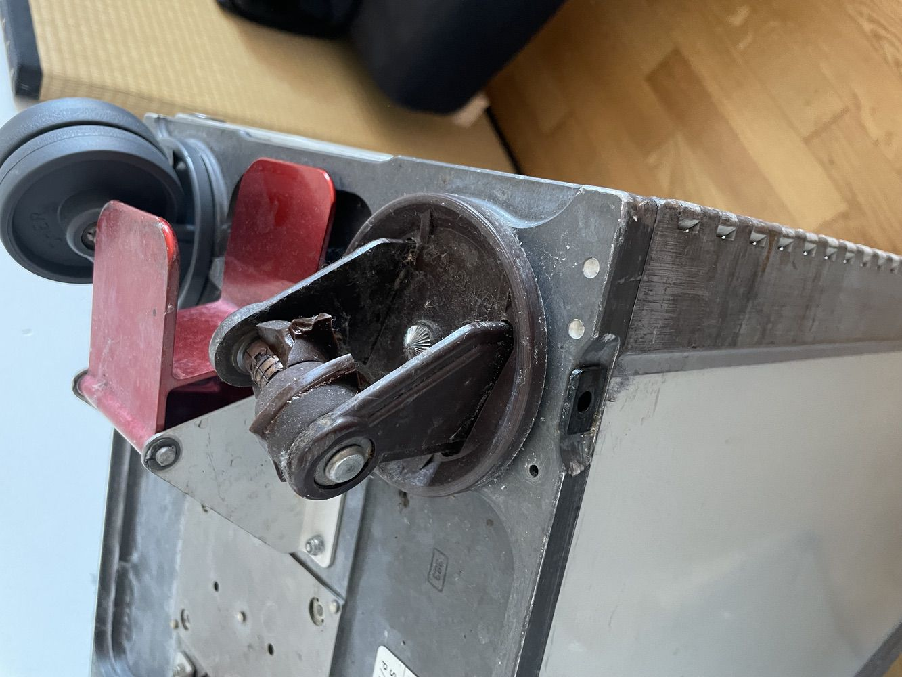
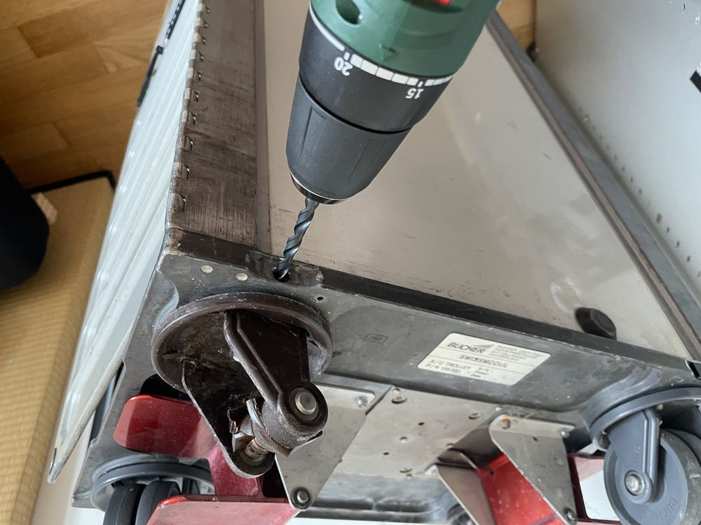
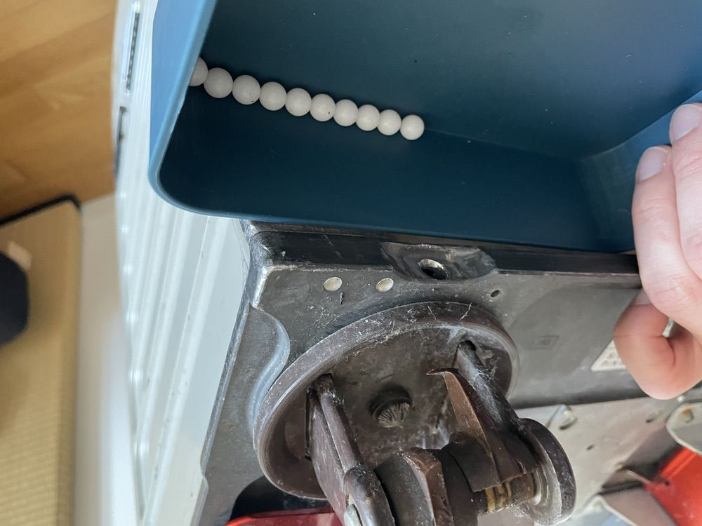
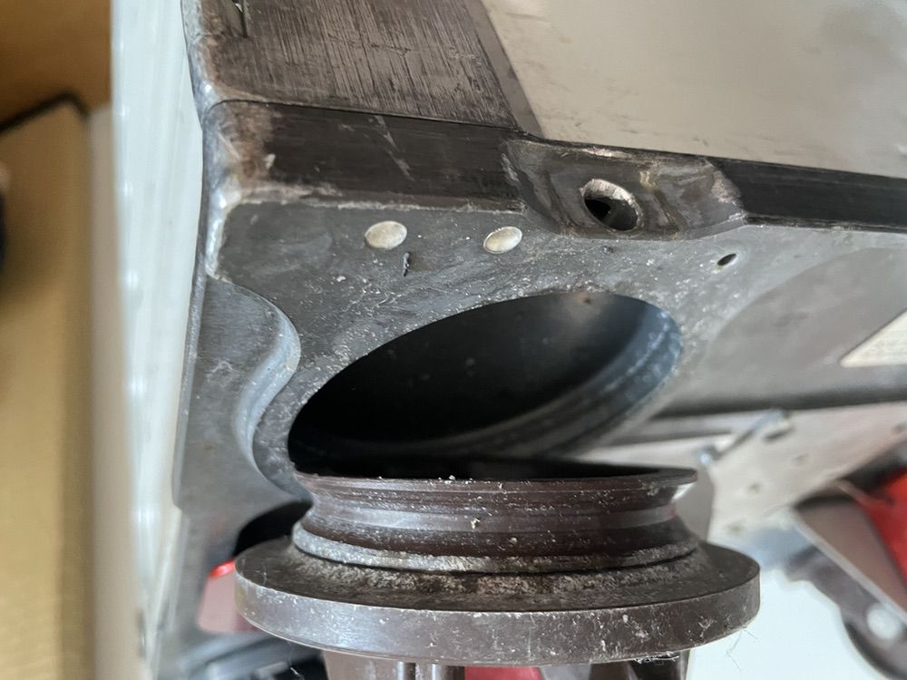
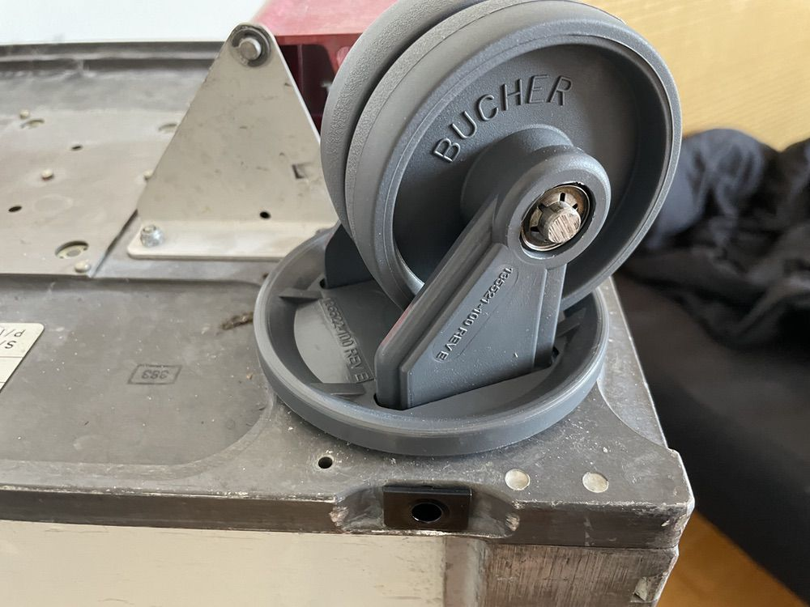

# Rollers

## Open

Drill out the plastic pin (6 mm drill bit). Slightly tilt the trolley and let the balls (exactly 28 pieces) roll out.

## Remove

The old wheel can now be removed. Clean the balls and ball bearings.

Put the new wheel in place and insert the balls through the hole again. 28 balls are needed per wheel. Do not fill in more than 28 balls, otherwise the weel will not spin properly.

